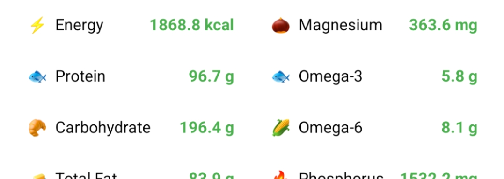

# OmniTracker

<p align="center">
  
</p>

A broad, simple health-logging app for tracking "anything and everything" with a focus on **nutrition** — snap a photo of a meal, supplement, or anything else, and get an automated nutrition and component breakdown alongside your log. Also tracks medications, stool, mood, and general wellness entries via quick photo capture and notes.

**Works with any multimodal chat-completions endpoint.** OmniTracker speaks the standard OpenAI chat-completions API, so any provider that supports vision/image inputs (OpenAI, OpenRouter, local Ollama/Llama.cpp with vision models, LM Studio, etc.) works out of the box. You configure base URL, API key, and model in-app; nothing is hardcoded to a specific vendor.

**Core philosophy:** super simple, low friction. Sensitive health photos stay in app-private storage, separate from your main camera roll.

## Features

- **Automatic nutrition calculation** — estimate calories, macros, and component breakdowns from just a photo and/or text note. No manual entry required.
- **Bring your own endpoint** — configure any multimodal OpenAI-compatible chat-completions endpoint (base URL, API key, model). Works with OpenAI, OpenRouter, local Ollama/Llama.cpp with vision models, LM Studio, and others. Requires a vision-capable model.
- **Recipes** — create and search a library of recipes. A recipe can be a photo of a dish, packaged food label, or nutrition facts panel; the AI extracts its components once and attaches them as batch context to future logs of that recipe.
- **Track anything** — log food, medications, supplements, stool, mood, and general observations. Each entry is typed automatically and can be marked private to keep it out of the gallery.
- **Import / Export** — back up and restore your database as JSONL (metadata only) or ZIP (full, with images). Lite exports summarize image content via the stored AI analysis instead of carrying file bytes.
- **Customizable tracking** — define additional nutrients or chemicals to track beyond the built-in baseline set; the AI fills them per entry when present.
- **Private, app-local photos** — images stay in app-private storage, separate from your main camera roll. Use the in-app camera, pick an existing photo from your gallery, or re-download any app-captured photo later.
- **Day summaries** — date-based history with per-day nutrition rollups (calories, macros, component aggregation, caloric-contribution percentages) and a shareable themed summary image.
- **On-device persistence** — Room/SQLite; data survives app restarts. Type-weighted gallery sorting and a "reuse" picker make revisiting common entries fast.
- **Background analysis** — WorkManager handles AI calls off the main thread, with in-app status and cancellation.

## Tech stack

- Native Android (Kotlin), Jetpack Compose (Material3)
- Gradle (Kotlin DSL), single-activity architecture
- Room (SQLite) for metadata; app-private picture storage for images
- WorkManager for background AI analysis

## Build & run

Requires **JDK 17** and the **Android SDK** (target API 35). Create a `local.properties` in the repo root (git-ignored) pointing at your SDK:

```properties
# Linux
sdk.dir=/home/<username>/Android/Sdk
# macOS
sdk.dir=/Users/<username>/Library/Android/sdk
```

Build and install to a connected device/emulator:

```bash
./gradlew installDebug
```

Build the APK only:

```bash
./gradlew assembleDebug
# -> app/build/outputs/apk/debug/omnitracker.apk
```

After any code change, do a clean rebuild (`./gradlew clean installDebug`) and restart the app to verify.

## Notes

- The app requests Camera/Location permissions on use; if denied, those features silently fail.
- Location relies on `FusedLocationProviderClient` and requires GPS/network to be active.
- AI features depend on your configured endpoint; you may hit rate limits (e.g. 429). Adjust the base URL/model in Settings or wait.

## License

MIT — see [LICENSE](LICENSE).
